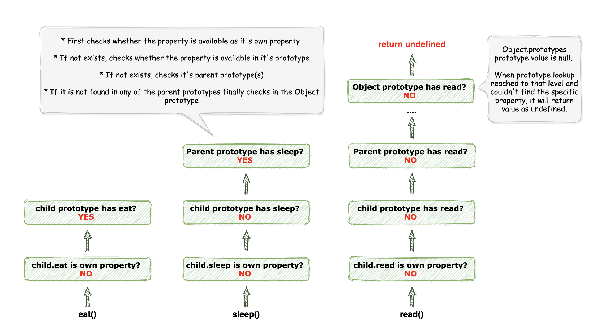
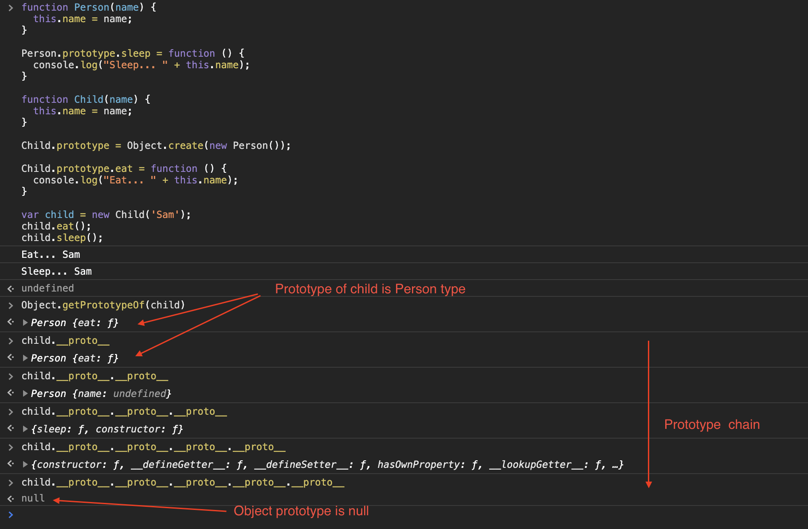

# Welcome to protptype

* Consider the following example.

  ```js
  var person = {}; // empty object
  
  console.log(person.toString()); output -> [Object Object] // print toString() method.
  ```

* Can you imagine from where this **toString** method comes in? The reason is Prototype. toString method is belongs to prototype object.

* Protptype is a special type of object which is associated with every function and object in Javascript. 

* You can access and modify prototype in functions and prototype in objects is not visible. In chrome and firefox you can check prototype properties by using **\_\_proto\_\_** key. (refer following examples)

    <div style="align: center">
        
    </div>

    ```js
    function Person(first, last) {
        this.firstName = first;
        this.lastName = last;
    }

    var person = new Person();

    console.log(Person.prototype); // object
    console.log(person.prototype); // undefined, objects doesn't have prototype property.
    console.log(person.__proto__); // object
    ```

* All JavaScript objects inherit properties and methods from a prototype. Ex: **Date objects inherit from Date.prototype**, **Array objects inherit from Array.prototype**, etc.

* **Object prototype** is the top level of prototype hierarchy. That means Date, Array and all other properties inherits properties from Object prototype.

* By using prototype you can add properties and methods to object contructors.

    ```js
    function Person(first, last) {
        this.firstName = first;
        this.lastName = last;
    }

    Person.prototype.age = 20;

    Person.prototype.getInfo = function() {
        return this.firstName + " " + this.lastName;
    };
    ```
* By defining propeties in prototype you can save memory. Consider previous example and assume you want to create many person objects. In that case, all person objects will add reference to those properties inside prototype without creating them multiple times.

## prototypal inheritance

* In Javascript prototypal inheritance is happended via **Prototypal Chain**.

* Let's see how it works.

    ```js
    function Person(name) {
        this.name = name;
    }

    Person.prototype.sleep = function () {
        console.log("Sleep... " + this.name);
    }

    function Child(name) {
        this.name = name;
    }

    Child.prototype = Object.create(new Person()); // (see [object.create]())

    Child.prototype.eat = function () {
        console.log("Eat... " + this.name);
    }

    var child = new Child('Sam');
    child.eat(); // Eat... Sam
    child.sleep(); // Sleep... Sam
    ```

    Here is what's happening inside. 

    <div style="align: center">
        
    </div>

* ES5 introduced the Object.getPrototypeOf() method that returns the prototype of a specified object.
    
    ```js
    console.log(Object.getPrototypeOf(child)); // Person {eat: ƒ}
    ```
* refer following image to get more details.

    <div style="align: center">
        
    </div>
