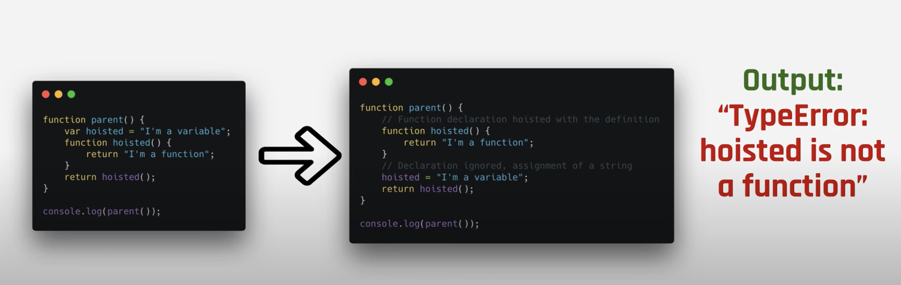

# Important things to know about javascript (part 1)

* Javascript is standardized as **ECMAScript(ES)** which is maintained by a committee called **TC39**. Each ES version decide what kind of features will be released to Javascript language.

* Javascript is **interpreted** and **compiled** language. ([more details can be found here](https://medium.com/@lsampath999/do-you-know-how-exactly-browser-works-9f510321ee9e))

* Currently Javascript is used as both client-side([Angular](https://angular.io/), [React](https://reactjs.org/), etc.) and server-side([NodeJS](https://nodejs.org/en/)) language.

* V8 (Google Chrome, NodeJS, Electron), SpiderMonkey (Firefox), Chakra (Microsoft Edge), Javascript Core (Safari, React Native), etc… are samples for available Browser Javascript Engines out there.

* Everything in Javascript is an **Object** (refer objects section for more details).

## variables & data types

* You can create variables using **var**, **let** and **const**.

* Javascript have **Number**, **String**, **Boolean**, **Null**, **Undefined**, **Symbol**(introduced in ES6) & **Object** data types. First 6 are primitive data types. You can use **typeof** to see the actual type of the variable. Remember Array is also a special type of an object.

## functions

* There are multiple ways to define functions. **Function Declaration**, **Function Expression**(can be used where you to pass function as a parameter), **Function Constructor**(which is not a recommended way), **Self Execution Function(IIFE)** & **Arrow Function**(introduced in ES6).

* You can use **call**, **apply** and **bind** with functions.
    - **call**: a function can be called with given **this** value and provided arguments.
        ```js
        myFunc.call(thisContext, arg1, arg2, ...);
        ```
    - **apply**: Behaviour is similer to call. But the arguments are provided as array.
        ```js
        myFunc.apply(thisContext, [arg1, arg2, ...]);
        ```
    
    - **bind**: a function can be bind to the given **this** value with the provided arguments. This will immediately return a function after calling with bind.
        ```js
        myFunc.bind(thisContext, arg1, arg2, ...);
        ```
    Examples

    ```js
    var person = {
        firstName: 'John',
        lastName: 'Doe'
    }
    
    function myFun(greeting) {
        console.log(`${greeting} ${this.firstName} ${this.lastName}`);
    }
    
    myFun('hello!'); // hello! undefined undefined
    myFun.call(person, 'hello!'); // hello! John Doe
    myFun.apply(person, ['hello!']); // hello! John Doe
    
    myFun.bind(person, 'hello!'); // return an invokable function
    myFun.bind(person, 'hello!')(); // hello! John Doe
    ```

* A closure is the combination of a function and the [lexical environment](https://developer.mozilla.org/en-US/docs/Web/JavaScript/Closures#:~:text=A%20closure%20is%20the%20combination,state%20(the%20lexical%20environment).&text=In%20JavaScript%2C%20closures%20are%20created,created%2C%20at%20function%20creation%20time) within which that function was declared.

    ```js
    function makeFunc() {
      var name = 'Mozilla';
      function displayName() {
        alert(name);
      }
      return displayName;
    }

    var myFunc = makeFunc();
    myFunc(); // myFunc is a closure where it remembers scope within makeFunc
    ```

* Arrow functions gives you the lexical binding and allows you to access parent scope. Refer age variable in the following example.
    
    ```js
    function Person() {
      this.age = 0;
      
      setInterval(() => {
        this.age++;
        console.log(this.age);
      }, 1000);
    }

    var p = Person();
    ```

* Always define functions and varibales before using them. You can define variable without "var" keyword. But it is not a good practice. Therefore, make sure to declare variables. Using ES5 "use strict" directive will help help you to alert when you forget to define variables.

## scope

* Javascript has two main scopes. **Global** scope where window object exists and **Functional** scope within functions. In addition to that, let and const allows you to define **Block** level scoping.

## hoisting

* Javascript hoisting is important concept where all **variable and function declarations** are moved to the scope that they have defined. When hoisting happens alway Function declarations gets priority over the variables. 

* If someone declare variable and function with same name that variable declaration will be ignored (refer following image).

    <div style="align: center">
        
    </div>


* Variables and constants declared with let and const are not hoisted. Also Function expressions are not hoisted.

## objects

* An object is collection of propeties. A property is key value pair. Each key is always a string and value can be anything. Each property has attributes of **value**, **writable**, **enumerable** (can iterate via for..in loops) and **configurable**(is deletable). Sample object shown in below.

    ```js
    var person = {
        firstName: 'John',
        lastName: 'Doe'
    }
    ```

* Object properties can be accessed in this way ->  person.firstName -> [objectName].[propertyKeyName]

* Also you can assign new properties as follows.

    ```js
    person['age'] = 12;
    ```
    
    - Also by using [Object.defineProperty](https://developer.mozilla.org/en-US/docs/Web/JavaScript/Reference/Global_Objects/Object/defineProperty) you can add new propeties as well as you can change the existing properties.
    

* There are multiple ways to create objects in Javascript. 
    - Object literal
    
    ```js
    var person = {
        firstName: 'John',
        lastName: 'Doe'
    }
    ```
    
    - Object.create
    
    ```js
    var person = {
        firstName: 'John',
        lastName: 'Doe'
    }
    
    var boy = Object.create(person) // this will set person object as the prototype of new boy object.
    ```

